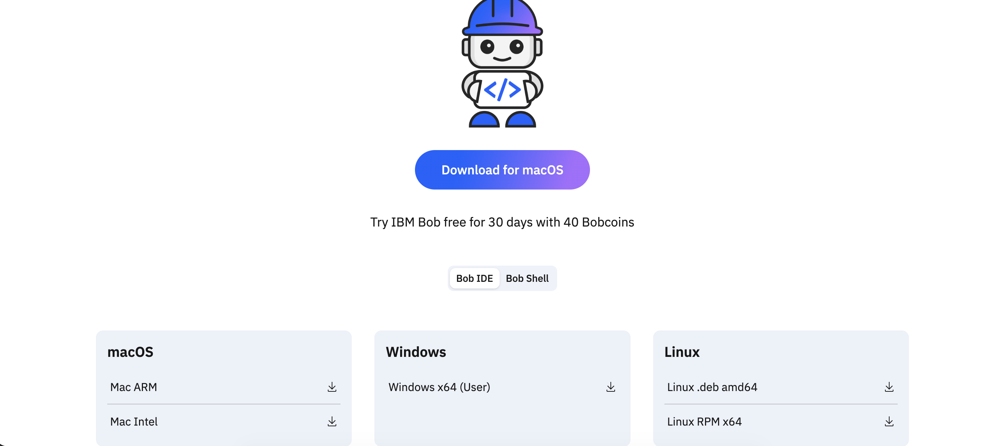
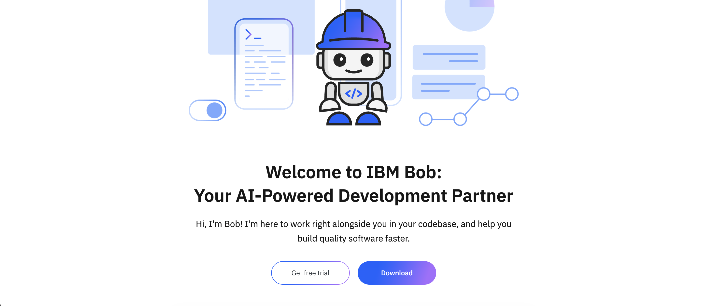
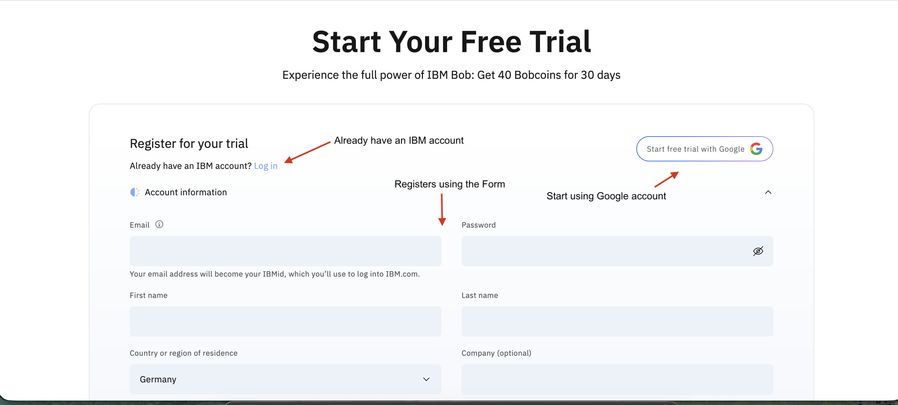
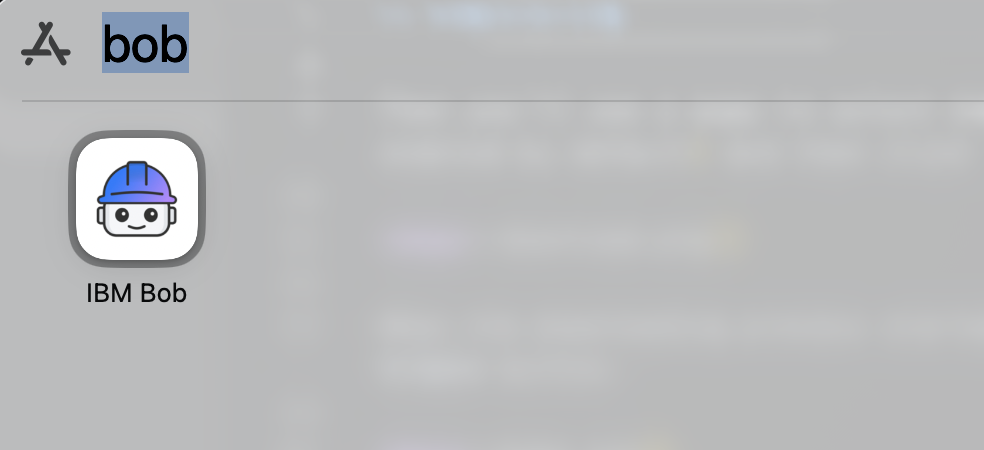
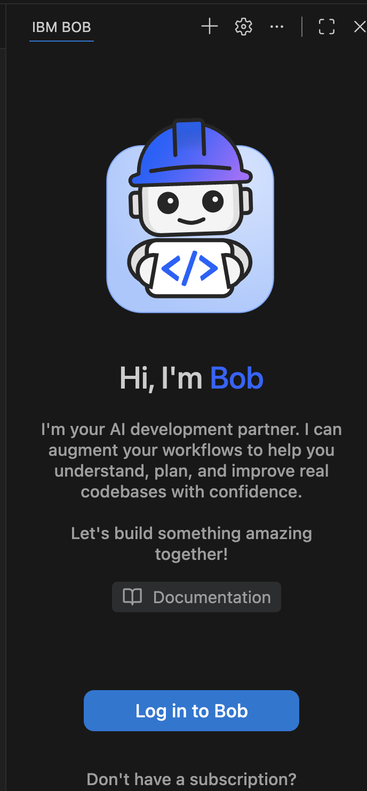
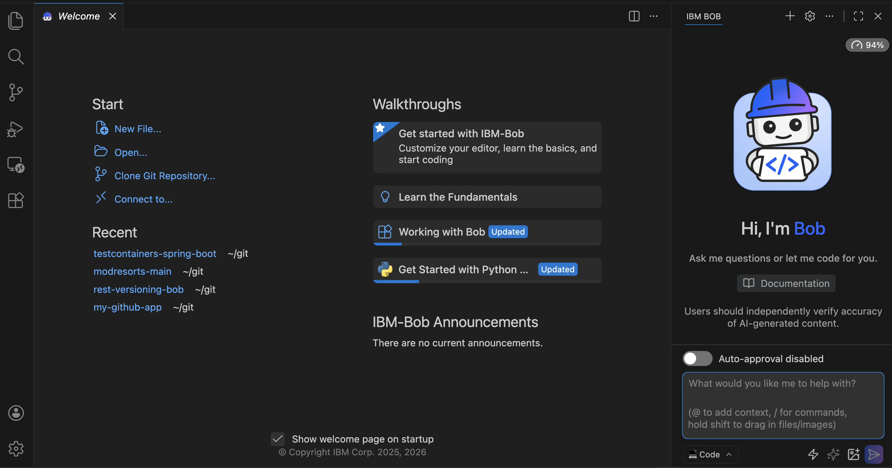

= Setup

Before starting the workshop, you need to download IBM Bob if you haven't already and register for a free trial to get some coins.

== Registering

Go to https://bob.ibm.com/ and click on the *Download* button.

Then you'll see a page to select downloading _Bob IDE_ or _Bob Shell_, choose Bob IDE (it is enabled by default), and then click to download it for your platform:

When the download starts, go back to the previous page and click the *Get free trial* button.

If you already have an IBM account, you can _Log in_ from there; if not, register either using your Google account or filling the form:

== Installing IBM Bob

After the registration process, you have 40 coins available to use with IBM Bob.

Then install IBM Bob by double-clicking the file you downloaded in the previous step.
The process might change depending on your system.

Then find the IBM Bob logo and click it to open Bob:

== Login

With IBM Bob opened, log in to Bob using the _Log in to Bob_ button.

Accept Bob's request to open the credentials page in a web browser, then log in with the credentials.

When logged in, click Push to continue in IBM Bob, and you should see the prompt window so you can start prompting LLMs through Bob.

