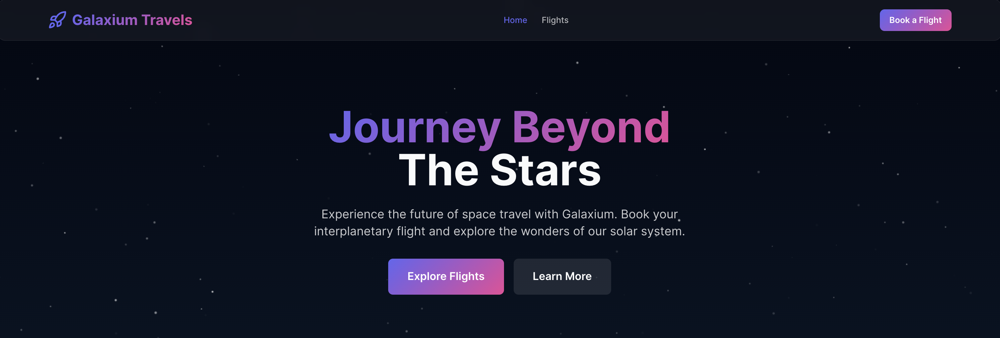
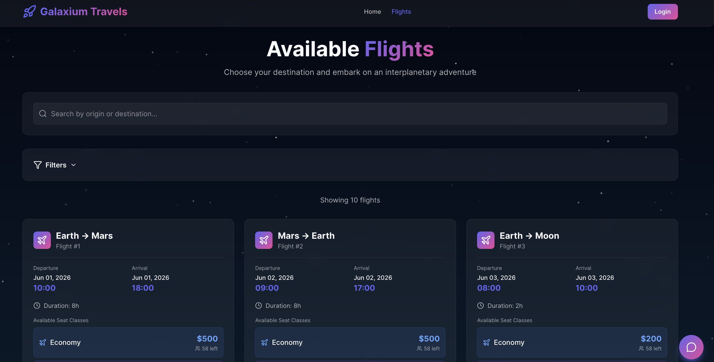
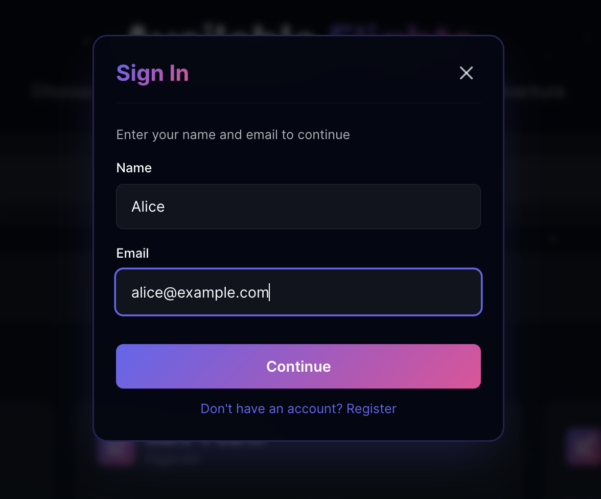
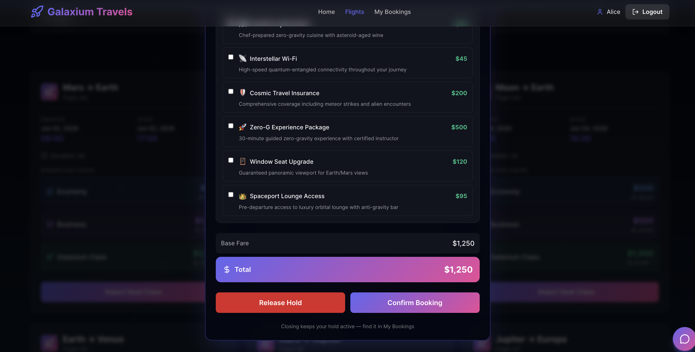

= 🚀 Galaxium Travels - Interplanetary Booking System

A complete full-stack application for booking interplanetary space travel, featuring a modern React frontend and 
Quarkus backend with REST and ChatBot support.
The Hold Service (Reservations) is implemented in Spring Boot.

== 🌟 Features

Modern Space-Themed UI:: - Beautiful, responsive interface with animated starfield
Full Booking System:: - Browse flights, make bookings, manage reservations
Three Seat Classes:: - Economy, Business, and Galaxium Class with independent availability tracking
Dynamic Pricing:: - Class-based multipliers (1x, 2.5x, 5x) applied to base flight prices
Type-Safe:: - Full TypeScript frontend and Java type hints with strict validation
Real-Time Updates:: - Live seat availability per class and booking status
User Management:: - Simple name/email authentication
AI:: - Chat Bot integration

== 🚛 Installation

Clone the following repository that contains the application under test:

[source, bash]
---- 
git clone https://github.com/lordofthejars-ai/galaxium-travels.git
----

== 🚀 Manual Quick Start

* NodeJS 18+
* Java 21+
* Podman/Docker

Open 3 terminal windows and start each service.

=== Frontend

[source, bash]
----
cd booking_system_frontend
npm install
npm run dev
----

=== Backend

[source, bash]
----
cd booking-system-backend-quarkus
./mvnw quarkus:dev
----

IMPORTANT: You need to have Podman/Docker (Desktop) installed to run this demo. The Quarkus application will automatically start the PostgreSQL container.

=== Hold Service

[source, bash]
----
cd inventory_hold_service
./mvnw clean package -DskipTests
java -jar target/inventory-hold-service-1.0.0.jar
----

Then you can go to the browser http://localhost:5173/ and start using the app.

== 🖼️ Demo

Open the page and click the `Book a Flight` button:

Then, before booking a flight, push the `Login` button:

And use `Alice` and `alice@example.com` to authenticate:

After that, select one of the flights and run the entire flow until you book it.

If you finish without any errors, it means that the application is running correctly, and we can start using the code assistant.