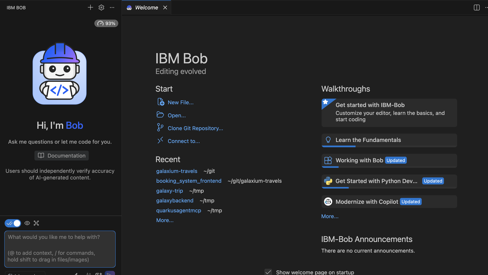
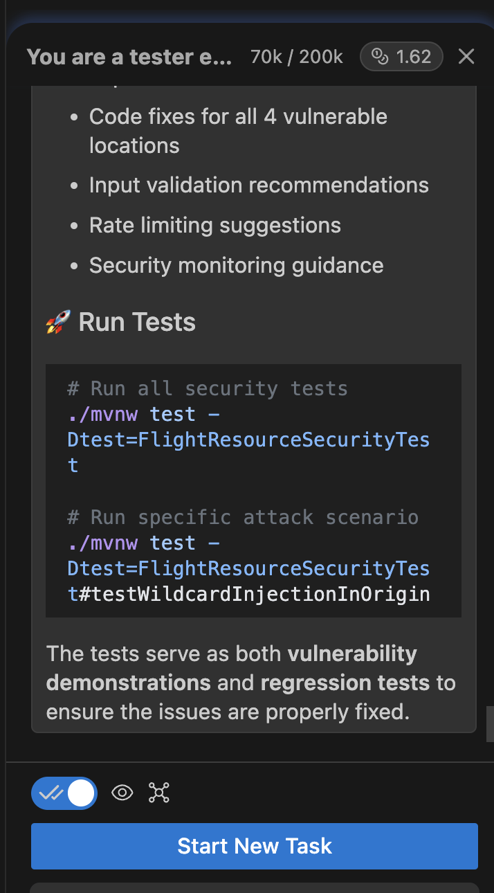
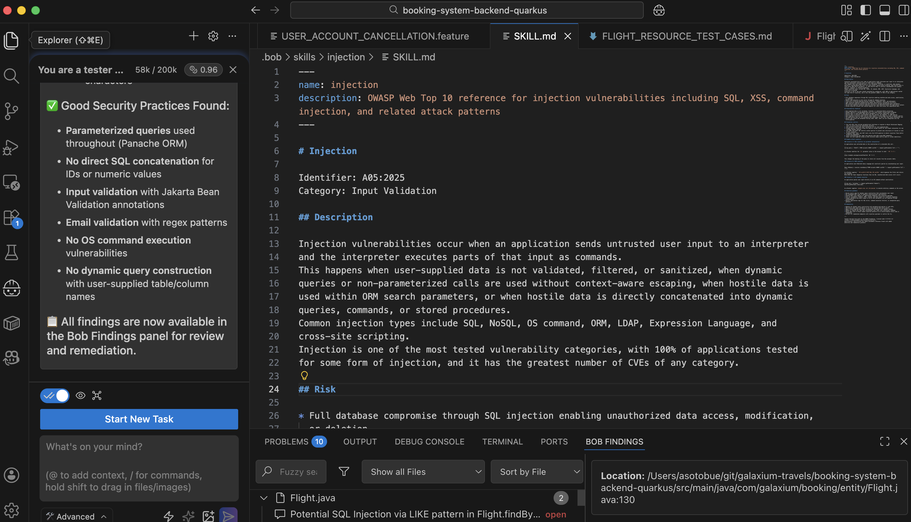

= Generating Tests for Backend

Open IBM Bob (or the code assistant of your choice) and use the `Open` link from the welcome page to open the `booking-system-backend-quarkus` project:



To start prompting the code assistant in Bob, open the IBM Bob tab, then start typing prompts.

== Test Case Generation

Let's start with a simple one: a developer has written some business logic but didn't write tests, or we've detected a missing piece.

[quote, IBM BOB]
----
Act as a Tester, Generate relevant test cases for the FlightResource use case For each test, include Name, Description, Steps, and Expected Result. Consider both typical use cases and edge cases.
----

It creates a Markdown file that describes all test cases.

If the test case has not been generated, ask the code assistant to do it.

[quote, IBM BOB]
----
Act as a developer, using the FLIGHT_RESOURCE_TEST_CASES.md file, can you implement the first 2 use cases using JUnit and Quarkus Test framework?
----

Notice that the code assistant creates a new `FlightResourceTest` Java class and verifies it by running Maven.

== Negative Testing

Sometimes there are tests, but they only cover the _happy path_. 
As testers, we might ask code assistants to detect this situation and fix the missing parts.

[quote, IBM BOB]
----
Act as a Tester, what are some negative test cases for the UserResource registerUser endpoint? How could this be tested with invalid or unexpected input?
----

Code assistant creates a new file `USER_RESOURCE_NEGATIVE_TEST_CASES.md` with the negative tests.

If the test case has not been generated, run the following prompt:

[quote, IBM BOB]
----
Act as a Developer, Using the USER_RESOURCE_NEGATIVE_TEST_CASES.md file can you implement the first 2 use cases using JUnit and Quarkus Test framework.
----

As in the previous case, code assitant creates a new class file and executes the verify they are working.

After this, push the `Start New Task` button to start a new conversation.



== Regression Testing

Sometimes we know developers will add a new feature in the next release, and we want to prepare a document outlining possible regressions.

[quote, IBM BOB]
----
Act as a Tester, identify the areas of the system that should be included in regression testing after changes are made to add the unregistration of a user. DON'T implement anything. 

Create a file with all the areas.
----

Code Assistant creates a new file with possible regressions.

After this, push the `Start New Task` button to start a new conversation.

== Bug Report Creation

If a user or a customer reports a bug, it is always important to create a test to reproduce it.

[quote, IBM BOB]
----
A User reported that when finding a booking by a negative userId, the application throws an exception. Can you create a reproducer?
The user might be wrong; your mission is to determine whether it is reproducible.
----

Code assistant creates tests, tries to reproduce the issue reported by the user by exploring different options, and finally creates a report `BOOKING_NEGATIVE_USER_ID_REPRODUCER.md`.

After this, push the `Start New Task` button to start a new conversation.

== Test Coverage

Developers always try their best to write as many tests as possible, but it is always difficult to cover all use cases.
We can use code assistants to improve the test coverage.

[quote, IBM BOB]
----
As a Tester, based on UserResourceNegativeTests, can you identify gaps and areas where coverage is inadequate? Suggest additional tests to ensure comprehensive coverage.
----

Creates a report with ideas on how to increase test coverage.

== Test Coverage Improvement

In some cases, we want to improve test coverage by inspecting the code, reading previous test coverage reports, and seeing how to improve.

[quote, IBM BOB]
----
Act as a tester explorer to find test cases to improve the test coverage based on the current JaCoCo test coverage report placed at src/test/resources/jacoco.xml file.
Read the JaCoCo file, explore what code has been already tested, and what tests could be done to improve the coverage. 
It is not necessary to have 100% coverage, but increasing coverage for relevant cases is necessary. 
----

Creates a report with ideas on how to increase test coverage in a file named `TEST_COVERAGE_ANALYSYS.md`.

With an analysis of what tests cover, what's not, and which methods would be critical to cover.
Our job as testers is to review the test plan and propose any modifications that would benefit testing.

We could ask Code Assistant to implement tests based on this analysis, but we'll skip for now, as it is not the purpose of this workshop.

After this, push the `Start New Task` button to start a new conversation.

== Test Performance

Performance testing is also an important part of most applications; there are many possible frameworks to implement it, such as JMeter, Gatling (in Java), or Locust. 
But the important thing here is to understand what the acceptable values are for each case, and which thresholds are acceptable or not.

Code Assistants can help with that, too, based on the trained data.

[quote, IBM BOB]
----
You are a test engineer expert on designing performance tests. What performance tests are needed to test UserResource functionality? This functionality is not critical as users register sporadically. Include load, stress, scalability, and resource utilization tests. Provide threshold values in line with industry standards.
----

Test Performance Includes:

* Load Testing - Normal registration patterns (2-5 req/sec, 95th percentile < 500ms)
* Stress Testing - Breaking point identification, duplicate email attacks, and connection exhaustion
* Scalability Testing - Incremental load (5→80 users), database scalability (1K→1M users)
* Resource Utilization - CPU (<70%), memory (no leaks), DB connections (<60%), network I/O
* Endurance Testing - 24-hour soak test with stability monitoring
* Concurrency Testing - Race conditions, duplicate registration prevention (100% data integrity)
* Failure Recovery - Database failures, transaction rollbacks, automatic recovery

We could ask Code Assistant to implement tests based on this analysis, but we'll skip for now, as it is not the purpose of this workshop.

After this, Push the `Start New Task` button to start a new conversation.

== BDD with Gherkin

Ideally, we should have BDD specs done before any implementation; however, we are in a rush, or it is legacy code, so no specs have been done yet.
Not all projects have a way to verify that the application is doing what the business mandates, even though, of course, we know they are doing it because it has been running for years. 

But this is not an excuse to not have a minimal set of tests to verify its behavior.

[quote, IBM BOB]
----
You are a tester engineer who undestands code. You need to understand what FlightResource does, then generate a Gherkin specification file with features, scenarios, and Given/When/Then steps that explain your findings and propose test data.
----

Created comprehensive Gherkin specification file: `FLIGHT_RESOURCE_GHERKIN_SPECIFICATION.feature`

== New Feature

In some cases, you've got a specification in plain text, and you need to write it in Gherkin format as the first step before coding the test.

Let's use the code assistant to interpret a requirement and create the Gherkin file.

[quote, IBM BOB]
----
You are a tester engineer. Read the following requirement and implement the Gherkin file:

"A user can cancel their account at any time. The user must be logged in, and when they click on the cancel button, they must be deleted from the system."

Only implement the Gherkin file so I can review it before implementing it.
----

Gherkin feature file created: `USER_ACCOUNT_CANCELLATION.feature`

The specification includes comprehensive test scenarios; in a real scenario, you should validate whether all assumptions are correct and remove those that make no sense.

After this, Push the `Start New Task` button to start a new conversation.

== Security

Security tests are also a kind of test that requires collaboration between testers, the security team, and developers.
Now, you can use the code assistant with Skills to verify the application's security, and write tests to ensure it is not happening.

Let's create a SKILL that is an expert for validating that there is no code injection in the application.
The content of this file will serve as context for the code assistant to identify exactly which security vulnerability to search for.

Create the following directory layout in the root of the project: `.bob/skills/injection`.

Inside the `injection` directory, create a file named `SKILL.md` with the following content:

```markdown
---
name: injection
description: OWASP Web Top 10 reference for injection vulnerabilities, including SQL, XSS, command injection, and related attack patterns
---

# Injection

Identifier: A05:2025
Category: Input Validation

## Description

Injection vulnerabilities occur when an application sends untrusted user input to an interpreter
and the interpreter executes parts of that input as commands.
This happens when user-supplied data is not validated, filtered, or sanitized, when dynamic
queries or non-parameterized calls are used without context-aware escaping, when hostile data is
used within ORM search parameters, or when hostile data is directly concatenated into dynamic
queries, commands, or stored procedures.
Common injection types include SQL, NoSQL, OS command, ORM, LDAP, Expression Language, and
cross-site scripting.
Injection is one of the most tested vulnerability categories, with 100% of applications tested
for some form of injection, and it has the greatest number of CVEs of any category.

## Risk

* Full database compromise through SQL injection enabling unauthorized data access, modification,
 or deletion.
* Remote code execution on the server through OS command injection.
* Cross-site scripting enabling session hijacking, credential theft, and defacement.
* LDAP injection enables authentication bypass and directory information disclosure.
* ORM injection enabling unauthorized data extraction through manipulated query parameters.
* Server-side template injection enabling arbitrary code execution within the application context.
* Stored injection attacks that execute against all users who access the compromised data.

## Vulnerability checklist

* User-supplied data is not validated, filtered, or sanitized before processing.
* Dynamic queries or non-parameterized calls are used without context-aware escaping.
* Hostile data is used within ORM search parameters to extract additional records.
* Hostile data is directly concatenated into SQL queries, OS commands, or LDAP queries.
* User-supplied structure names, such as table names or column names, are used in dynamic queries.
* The application does not use parameterized interfaces or safe APIs that avoid interpreter use.
* Source code review and automated testing (SAST, DAST, IAST) are not integrated into the
 CI/CD pipeline.

## Prevention controls

1. Use safe APIs that provide parameterized interfaces or migrate to Object Relational Mapping
 tools to avoid using the interpreter directly.
2. Use positive server-side input validation for all user-supplied data.
3. Escape special characters using the specific escape syntax for the target interpreter for any
 residual dynamic queries.
4. Use LIMIT and other SQL controls within queries to prevent mass disclosure of records in case
 of SQL injection.
5. Integrate SAST, DAST, and IAST tools into the CI/CD pipeline to detect injection flaws before
 production deployment.
6. Avoid concatenating user input into queries even when using ORM frameworks.
7. Never use user-supplied values as SQL structure names, such as table or column identifiers.

## Example attack scenarios

### Scenario A — SQL injection via parameter manipulation

An application uses untrusted data in the construction of a vulnerable SQL call:

```
String query = "SELECT * FROM accounts WHERE custID='" + request.getParameter("id") + "'";
```

An attacker modifies the `id` parameter value in the browser to send `' OR '1'='1`:

```
http://example.com/app/accountView?id=' OR '1'='1
```

This changes the query to return all records from the accounts table.

### Scenario B — ORM injection

An application uses Hibernate Query Language but constructs queries by concatenating user input:

```
Query HQLQuery = session.createQuery("FROM accounts WHERE custID='" + request.getParameter("id") + "'");
```

An attacker supplies `' OR custID IS NOT NULL OR custID='` which bypasses the filter and returns
all accounts.
While HQL has fewer dangerous functions than raw SQL, unauthorized data access still occurs.

### Scenario C — OS command injection

An application passes user input directly to an OS command without sanitization:

```
String cmd = "nslookup " + request.getParameter("domain");
Runtime.getRuntime().exec(cmd);
```

An attacker supplies `example.com; cat /etc/passwd` to execute arbitrary commands on the server.

## Detection guidance

* Review source code for dynamic query construction that concatenates user input.
* Run automated SAST scans to identify injection-prone code patterns.
* Execute DAST scans against all application endpoints with injection payloads.
* Fuzz all parameters, headers, URLs, cookies, and data inputs for injection responses.
* Inspect parameterized query usage to verify that parameters are not bypassed through
 concatenation.
* Monitor application logs for SQL errors, command execution failures, or unexpected query
 patterns.

## Remediation

* Replace all dynamic query construction with parameterized queries or safe APIs.
* Add server-side input validation to all user-supplied data entry points.
* Apply context-appropriate output encoding and escaping to all dynamic content.
* Remove or replace any code that concatenates user input into interpreter commands.
* Deploy WAF rules to block common injection patterns as an interim measure while code is
 remediated.
* Re-test all remediated endpoints with injection payloads to confirm the fix.

---

Content derived from works by the OWASP Foundation, licensed under CC BY-SA 4.0
(<https://creativecommons.org/licenses/by-sa/4.0/>).
Modifications: Restructured into agent-consumable reference format with added
detection and remediation guidance.
```

Now, let's verify that the code assistant detects this skill.
Use the following prompt:

[quote, IBM BOB]
----
What skills do you have installed?
----

And you should see a summary of the skill we have just created.
Now, let's first scan the code for any of these vulnerabilities.

[quote, IBM BOB]
----
You are a security expert, can you verify that there is no injection security vulnerability in the current code using the injection SKILL?
----

Code Assistant will review the code and provide some insights about security issues.
Moreover, in the case of IBM Bob, you'll have a panel inside a Tab with the title `Bob Findings` to review each of them:



Without starting a new conversation, run the following prompt:

[quote, IBM BOB]
----
You are a test engineer. Can you write tests for the high-severity issues? The idea is to have some tests representing what an attacker might use to exploit the application.
----

It will create some test classes to verify the high-severity issues.

Of course, you could ask IBM Bob to generate the code to fix the security issues, but this is an exercise for developers.

These tests are white-box tests, or tests that verifies a part of the application. We'll start doing more black-box testing to verify the entire web application.
