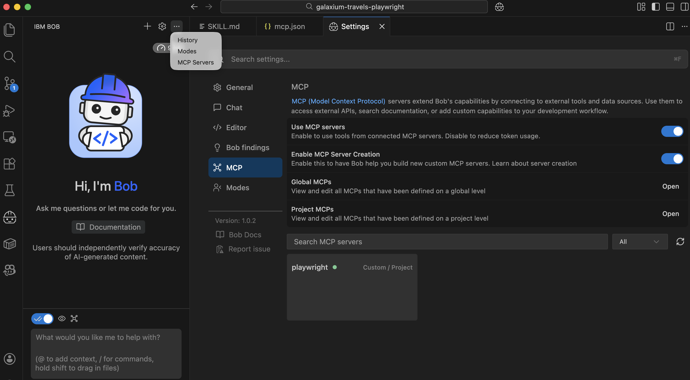
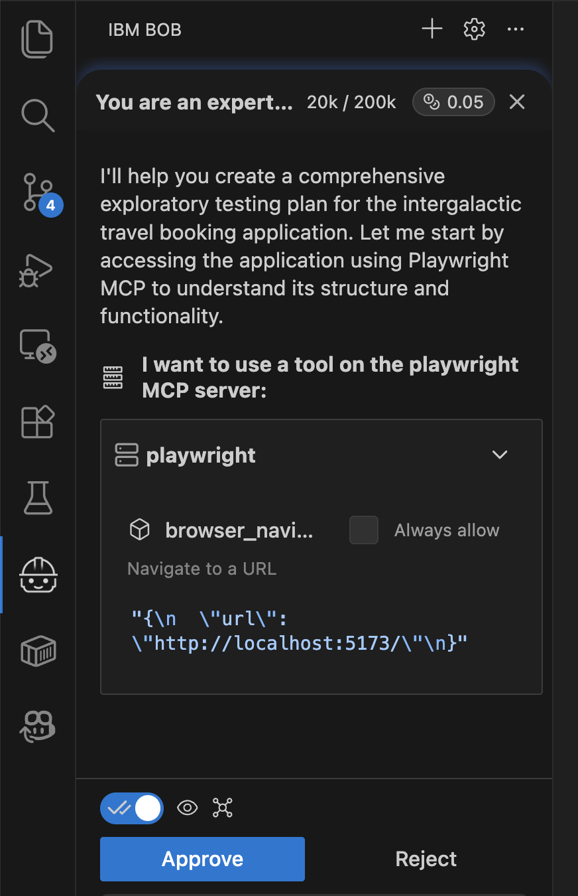

= Exploratory Testing with Playwright

One of the things QAs do all the time is execute exploratory testing to verify that everything works as expected, but relying on intuition, domain expertise, and creativity to uncover hidden defects and edge cases from a real user's perspective.

That's good, and we still need to do it, but let the machines do some of this work as they can navigate and explore the web application for us.

Since this is a web application, we need to connect the code assistant to the browser so it can navigate through the website, verify that no errors are found, and so on.

In this case, we'll use Playwright to interact with the browser, and the Playwright MCP Server as a bridge between the LLM/Code Assistant and Playwright.

== Opening New Project

Close IBM Bob project, and `Open` a new one pointing to `galaxium-travels-playwright` placed in this workshop layout.

== Configuring Code Assistant

To configure IBM Bob to use the MCP Server, go to the `.bob` directory (it is already created and has some content there), and create a `mcp.json` file with the following content:

[source, json]
----
{
  "mcpServers": {
    "playwright": {
      "type": "stdio",
      "command": "npx",
      "args": [
        "@playwright/mcp@latest"
 ],
      "disabled": false,
      "alwaysAllow": [
        "browser_snapshot",
        "browser_click",
        "browser_type",
        "browser_close"
 ]
 }
 }
}
----

Then save the file, and the MCP server is configured and started.
You can verify it by going to the MCP Servers section:

Now, we can start prompting the Code Assistant to do an exploratory test plan.

IMPORTANT: Before executing any prompt, read the two following sections. They use tokens extensively (around 11 IBM Bob coins per execution). To save some coins, you can try to modify the prompts to squash the generation of the test plan and the implementation of the test plan into one execution.

== Exploratory Test Plan

Let's start by asking to create a test plan:

[quote, IBM BOB]
----
You are an expert tester, and you need to do an exploratory testing plan for my web application hosted at http://localhost:5173/

The application is a webpage for booking intergalactic trips, so you can expect flights, bookings, various trip types (economy, business, ...), and extras such as heavy luggage.

When you need to log in to the system, use the username Alice and the email alice@example.com as your password/email.

Your mission is to act as a user of the system who wants to book a new flight.

Use the Playwright MCP to access the web application.

You ONLY need to create a testing plan with as much information as possible so that it can be used later by a human and to generate automated tests using Playwright code.
----

Notice that I am giving a lot of context, so even though we expect some freedom, we also want the system to execute things more or less deterministically and with some meaning.

When you execute the prompt, notice that a browser starts; keep it open in the side panel and keep an eye on the Code Assistant chat, as it might ask you to approve MCP operations.
If you don't approve it, execution is paused, and no activity occurs.

After a few minutes, and after watching the browser handle things automatically, we end up with an exploratory testing plan file that outlines all the steps you can execute and some open questions that could be addressed.

== Implementing Test Plan

For now, let's leave the test plan as is. We can get feedback from the Code Assistant and ask it to improve the code further, but for simplicity, let's have it implement the exploratory test.

WARNING: This step consumes a lot of tokens. You can skip it if you only have a few tokens left to run the workshop's last example.

[quote, IBM BOB]
----
You are an expert Java developer who knows how to write Playwright tests.

Implement only the exploratory test plan created in the previous step using the Playwright Java framework and following best practices, such as the Page Objects pattern.
The project already has the Playwright dependency registered, so the version is fixed and doesn't need to be changed or configured.

Use the Plywright MCP to execute and get any runtime information you need to generate the test, and also use the playwright-java skill to find the best practices before implementing anything with Playwright Java. 
----

After the prompt executes, Code Assistant creates all the Playwright classes required to implement the tests. 

Now is the time to ask Code Assistant to implement any of the test cases. 
Notice that this step might not be required if it has condensed class creation and testing into a single step.
Just follow the AI conversation.

[quote, IBM BOB]
----
Can you code the smoke-test classes using the previously implemented classes?
----

After a few minutes, we'll have implemented all the smoke tests for the application using all the infrastructure classes created previously.
